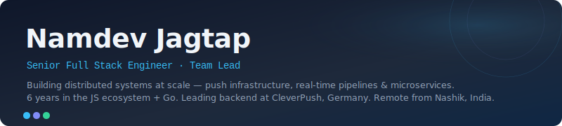

---

### ⚙️ Tech Stack

**Languages**

**Frontend**

**Backend**

**APIs & Messaging**

**Databases & Caching**

**Infrastructure**

---

### 💼 Experience

<table>
  <tr>
    <td width="52%" valign="top">
      <strong>🟢 Senior Full Stack Engineer · Team Lead</strong> 
      <a href="https://cleverpush.com">CleverPush</a> — Germany
    </td>
    <td width="48%" valign="top">
      <code>Jan 2022 → present</code> 
      Distributed sending pipelines, statistics infrastructure, microservices at scale.
    </td>
  </tr>
  <tr>
    <td valign="top">
      <strong>Software Engineer</strong> 
      Bytes Technolab
    </td>
    <td valign="top">
      <code>Jan 2020 → Jan 2022</code> 
      Real estate, e-commerce, and cybersecurity (SIRP SOAR) projects.
    </td>
  </tr>
  <tr>
    <td valign="top">
      <strong>Full Stack Developer</strong> 
      Application Nexus
    </td>
    <td valign="top">
      <code>Nov 2018 → Jun 2019</code> 
      MEAN stack development(Internship).
    </td>
  </tr>
</table>

---

### 📊 GitHub Stats

---

### 📇 Connect

